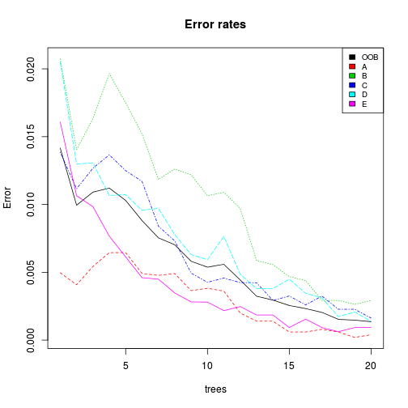
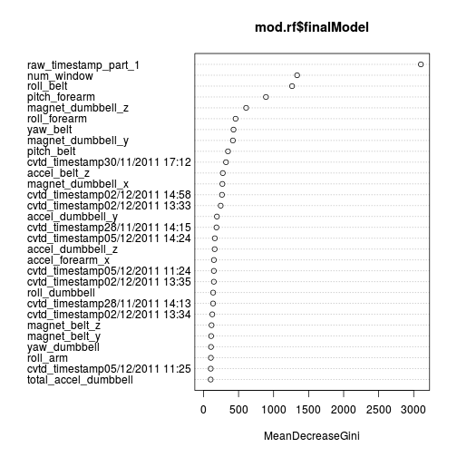

Weight Lifting Exercises Dataset
========================================================


## Load and preprocess data

First we download the files

```r
# training data set
fileUrl1 <- "https://d396qusza40orc.cloudfront.net/predmachlearn/pml-training.csv"
download.file(fileUrl1, destfile = "pml-training.csv", method = "curl")
training <- read.csv("pml-training.csv")
training <- training[,-1]

# testing data set

fileUrl2 <- "https://d396qusza40orc.cloudfront.net/predmachlearn/pml-testing.csv"
download.file(fileUrl2, destfile = "pml-testing.csv",method = "curl")
newdata <- read.csv("pml-testing.csv")
newdata <- newdata[,-1]
```
The dependent variable is classe and there are a lot of many potential predictors. The first decission we take is reduce variables. We only consider valid variables the variables which have values in test data set. Anyway, this variables are the variables with very few missing values in training data


```r
var.without.missing <- names(newdata)[!colSums(is.na(newdata))==nrow(newdata)]

summary(newdata[,var.without.missing])
```

```
##     user_name raw_timestamp_part_1 raw_timestamp_part_2
##  adelmo  :1   Min.   :1.32e+09     Min.   : 36553      
##  carlitos:3   1st Qu.:1.32e+09     1st Qu.:268655      
##  charles :1   Median :1.32e+09     Median :530706      
##  eurico  :4   Mean   :1.32e+09     Mean   :512167      
##  jeremy  :8   3rd Qu.:1.32e+09     3rd Qu.:787738      
##  pedro   :3   Max.   :1.32e+09     Max.   :920315      
##                                                        
##           cvtd_timestamp new_window   num_window    roll_belt     
##  30/11/2011 17:11:4      no:20      Min.   : 48   Min.   : -5.92  
##  05/12/2011 11:24:3                 1st Qu.:250   1st Qu.:  0.91  
##  30/11/2011 17:12:3                 Median :384   Median :  1.11  
##  05/12/2011 14:23:2                 Mean   :380   Mean   : 31.31  
##  28/11/2011 14:14:2                 3rd Qu.:467   3rd Qu.: 32.51  
##  02/12/2011 13:33:1                 Max.   :859   Max.   :129.00  
##  (Other)         :5                                               
##    pitch_belt        yaw_belt     total_accel_belt  gyros_belt_x   
##  Min.   :-41.60   Min.   :-93.7   Min.   : 2.00    Min.   :-0.500  
##  1st Qu.:  3.01   1st Qu.:-88.6   1st Qu.: 3.00    1st Qu.:-0.070  
##  Median :  4.66   Median :-87.8   Median : 4.00    Median : 0.020  
##  Mean   :  5.82   Mean   :-59.3   Mean   : 7.55    Mean   :-0.045  
##  3rd Qu.:  6.13   3rd Qu.:-63.5   3rd Qu.: 8.00    3rd Qu.: 0.070  
##  Max.   : 27.80   Max.   :162.0   Max.   :21.00    Max.   : 0.240  
##                                                                    
##   gyros_belt_y     gyros_belt_z     accel_belt_x     accel_belt_y  
##  Min.   :-0.050   Min.   :-0.480   Min.   :-48.00   Min.   :-16.0  
##  1st Qu.:-0.005   1st Qu.:-0.138   1st Qu.:-19.00   1st Qu.:  2.0  
##  Median : 0.000   Median :-0.025   Median :-13.00   Median :  4.5  
##  Mean   : 0.010   Mean   :-0.101   Mean   :-13.50   Mean   : 18.4  
##  3rd Qu.: 0.020   3rd Qu.: 0.000   3rd Qu.: -8.75   3rd Qu.: 25.5  
##  Max.   : 0.110   Max.   : 0.050   Max.   : 46.00   Max.   : 72.0  
##                                                                    
##   accel_belt_z    magnet_belt_x   magnet_belt_y magnet_belt_z 
##  Min.   :-187.0   Min.   :-13.0   Min.   :566   Min.   :-426  
##  1st Qu.: -24.0   1st Qu.:  5.5   1st Qu.:578   1st Qu.:-398  
##  Median :  27.0   Median : 33.5   Median :600   Median :-314  
##  Mean   : -17.6   Mean   : 35.1   Mean   :602   Mean   :-347  
##  3rd Qu.:  38.2   3rd Qu.: 46.2   3rd Qu.:631   3rd Qu.:-305  
##  Max.   :  49.0   Max.   :169.0   Max.   :638   Max.   :-291  
##                                                               
##     roll_arm        pitch_arm         yaw_arm       total_accel_arm
##  Min.   :-137.0   Min.   :-63.80   Min.   :-167.0   Min.   : 3.0   
##  1st Qu.:   0.0   1st Qu.: -9.19   1st Qu.: -60.1   1st Qu.:20.2   
##  Median :   0.0   Median :  0.00   Median :   0.0   Median :29.5   
##  Mean   :  16.4   Mean   : -3.95   Mean   :  -2.8   Mean   :26.4   
##  3rd Qu.:  71.5   3rd Qu.:  3.46   3rd Qu.:  25.5   3rd Qu.:33.2   
##  Max.   : 152.0   Max.   : 55.00   Max.   : 178.0   Max.   :44.0   
##                                                                    
##   gyros_arm_x      gyros_arm_y      gyros_arm_z      accel_arm_x    
##  Min.   :-3.710   Min.   :-2.090   Min.   :-0.690   Min.   :-341.0  
##  1st Qu.:-0.645   1st Qu.:-0.635   1st Qu.:-0.180   1st Qu.:-277.0  
##  Median : 0.020   Median :-0.040   Median :-0.025   Median :-194.5  
##  Mean   : 0.077   Mean   :-0.160   Mean   : 0.120   Mean   :-134.6  
##  3rd Qu.: 1.248   3rd Qu.: 0.217   3rd Qu.: 0.565   3rd Qu.:   5.5  
##  Max.   : 3.660   Max.   : 1.850   Max.   : 1.130   Max.   : 106.0  
##                                                                     
##   accel_arm_y     accel_arm_z      magnet_arm_x   magnet_arm_y 
##  Min.   :-65.0   Min.   :-404.0   Min.   :-428   Min.   :-307  
##  1st Qu.: 52.2   1st Qu.:-128.5   1st Qu.:-374   1st Qu.: 205  
##  Median :112.0   Median : -83.5   Median :-265   Median : 291  
##  Mean   :103.1   Mean   : -87.8   Mean   : -39   Mean   : 239  
##  3rd Qu.:168.2   3rd Qu.: -27.2   3rd Qu.: 250   3rd Qu.: 359  
##  Max.   :245.0   Max.   :  93.0   Max.   : 750   Max.   : 474  
##                                                                
##   magnet_arm_z  roll_dumbbell     pitch_dumbbell   yaw_dumbbell    
##  Min.   :-499   Min.   :-111.12   Min.   :-55.0   Min.   :-103.32  
##  1st Qu.: 403   1st Qu.:   7.49   1st Qu.:-51.9   1st Qu.: -75.28  
##  Median : 476   Median :  50.40   Median :-40.8   Median :  -8.29  
##  Mean   : 370   Mean   :  33.76   Mean   :-19.5   Mean   :  -0.94  
##  3rd Qu.: 517   3rd Qu.:  58.13   3rd Qu.: 16.1   3rd Qu.:  55.83  
##  Max.   : 633   Max.   : 123.98   Max.   : 96.9   Max.   : 132.23  
##                                                                    
##  total_accel_dumbbell gyros_dumbbell_x gyros_dumbbell_y  gyros_dumbbell_z
##  Min.   : 1.0         Min.   :-1.030   Min.   :-1.1100   Min.   :-1.180  
##  1st Qu.: 7.0         1st Qu.: 0.160   1st Qu.:-0.2100   1st Qu.:-0.485  
##  Median :15.5         Median : 0.360   Median : 0.0150   Median :-0.280  
##  Mean   :17.2         Mean   : 0.269   Mean   : 0.0605   Mean   :-0.266  
##  3rd Qu.:29.0         3rd Qu.: 0.463   3rd Qu.: 0.1450   3rd Qu.:-0.165  
##  Max.   :31.0         Max.   : 1.060   Max.   : 1.9100   Max.   : 1.100  
##                                                                          
##  accel_dumbbell_x accel_dumbbell_y accel_dumbbell_z magnet_dumbbell_x
##  Min.   :-159.0   Min.   :-30.00   Min.   :-221.0   Min.   :-576     
##  1st Qu.:-140.2   1st Qu.:  5.75   1st Qu.:-192.2   1st Qu.:-528     
##  Median : -19.0   Median : 71.50   Median :  -3.0   Median :-508     
##  Mean   : -47.6   Mean   : 70.55   Mean   : -60.0   Mean   :-304     
##  3rd Qu.:  15.8   3rd Qu.:151.25   3rd Qu.:  76.5   3rd Qu.:-317     
##  Max.   : 185.0   Max.   :166.00   Max.   : 100.0   Max.   : 523     
##                                                                      
##  magnet_dumbbell_y magnet_dumbbell_z  roll_forearm    pitch_forearm   
##  Min.   :-558      Min.   :-164.0    Min.   :-176.0   Min.   :-63.50  
##  1st Qu.: 260      1st Qu.: -33.0    1st Qu.: -40.2   1st Qu.:-11.46  
##  Median : 316      Median :  49.5    Median :  94.2   Median :  8.83  
##  Mean   : 189      Mean   :  71.4    Mean   :  38.7   Mean   :  7.10  
##  3rd Qu.: 348      3rd Qu.:  96.2    3rd Qu.: 143.2   3rd Qu.: 28.50  
##  Max.   : 403      Max.   : 368.0    Max.   : 176.0   Max.   : 59.30  
##                                                                       
##   yaw_forearm      total_accel_forearm gyros_forearm_x  gyros_forearm_y 
##  Min.   :-168.00   Min.   :21.0        Min.   :-1.060   Min.   :-5.970  
##  1st Qu.: -93.38   1st Qu.:24.0        1st Qu.:-0.585   1st Qu.:-1.288  
##  Median : -19.25   Median :32.5        Median : 0.020   Median : 0.035  
##  Mean   :   2.19   Mean   :32.0        Mean   :-0.020   Mean   :-0.042  
##  3rd Qu.: 104.50   3rd Qu.:36.8        3rd Qu.: 0.292   3rd Qu.: 2.047  
##  Max.   : 159.00   Max.   :47.0        Max.   : 1.380   Max.   : 4.260  
##                                                                         
##  gyros_forearm_z   accel_forearm_x  accel_forearm_y  accel_forearm_z 
##  Min.   :-1.2600   Min.   :-212.0   Min.   :-331.0   Min.   :-282.0  
##  1st Qu.:-0.0975   1st Qu.:-114.8   1st Qu.:   8.5   1st Qu.:-199.0  
##  Median : 0.2300   Median :  86.0   Median : 138.0   Median :-148.5  
##  Mean   : 0.2610   Mean   :  38.8   Mean   : 125.3   Mean   : -93.7  
##  3rd Qu.: 0.7625   3rd Qu.: 166.2   3rd Qu.: 268.0   3rd Qu.: -31.0  
##  Max.   : 1.8000   Max.   : 232.0   Max.   : 406.0   Max.   : 179.0  
##                                                                      
##  magnet_forearm_x magnet_forearm_y magnet_forearm_z   problem_id   
##  Min.   :-714.0   Min.   :-787     Min.   :-32      Min.   : 1.00  
##  1st Qu.:-427.2   1st Qu.:-329     1st Qu.:275      1st Qu.: 5.75  
##  Median :-189.5   Median : 487     Median :492      Median :10.50  
##  Mean   :-159.2   Mean   : 192     Mean   :460      Mean   :10.50  
##  3rd Qu.:  41.5   3rd Qu.: 721     3rd Qu.:662      3rd Qu.:15.25  
##  Max.   : 532.0   Max.   : 800     Max.   :884      Max.   :20.00  
## 
```

We select newdata data.set and training data set only with this variables.


```r
newdata <- newdata[,var.without.missing]

training <- training[,c(var.without.missing[-59],"classe")]
```
Let's to create a train1 data set and testing data test from training data set. 


```r
library(caret)
```

```
## Loading required package: lattice
## Loading required package: ggplot2
```

```r
#libraries to allow use multicores in multicore system 
library(parallel)
library(doMC)
```

```
## Loading required package: foreach
## Loading required package: iterators
```

```r
registerDoMC(cores = 4) # my machine has 2 cores with 2 threads

id_train <- createDataPartition(training$classe, p=0.9, list=FALSE)

train1 <- training[id_train,]
testing <- training[-id_train,]
```

In order to process data we standardized numerical variables relate with accelerometers on the belt, forearm, arm, and dumbell.


```r
preStandz <- preProcess(train1[,6:58],method = c("center", "scale"))
```
And aplicate  to testing and newdata set.


```r
train1[,6:58] <- predict(preStandz, train1[,6:58])
testing[,6:58] <- predict(preStandz, testing[,6:58])

newdata[,6:58] <- predict(preStandz, newdata[,6:58])
```


## Building  models

We use a randomForest model with 20 trees where classe is dependent variable and all remaining variables are predictors. 
This algorithm does not affect  too much collinearity between variables. Therefore we will not use variable reduction techniques such as PCA.


We will use k-fold cross validation with 10 folds in order to account error and acuracy in data which we don't use in building models. Once fit the model, we evaluate again the error in testing data set.


```r
mod.rf <- train(classe ~ .,
                 method = "rf",
                ntree=20,
                 trControl=trainControl(method ="cv", allowParallel = TRUE),
                 data=train1 )
```

```
## Loading required package: randomForest
## randomForest 4.6-7
## Type rfNews() to see new features/changes/bug fixes.
```

We expect a high error in the 10 fold 

## Evaluate models

We can see the accuracy in the 10 fold 


```r
mod.rf$resample
```

```
##    Accuracy  Kappa Resample
## 1    0.9989 0.9986   Fold02
## 2    0.9994 0.9993   Fold01
## 3    0.9972 0.9964   Fold04
## 4    0.9994 0.9993   Fold03
## 5    1.0000 1.0000   Fold06
## 6    1.0000 1.0000   Fold05
## 7    0.9994 0.9993   Fold08
## 8    0.9994 0.9993   Fold07
## 9    0.9994 0.9993   Fold10
## 10   0.9994 0.9993   Fold09
```
Accuracy is the proportion of cases which the model clasify correctly. The misclass error  is 1-Accuracy. 
Surprised by the low error rate of this kind of model. We have and excellent model.

Error rates figures


```r
plot(mod.rf$finalModel,main="Error rates")
legend("topright", colnames(mod.rf$finalModel$err.rate),col=1:6,cex=0.8,fill=1:6)
```

 

OOB error is error in *Out Of Bagging* data
We can see the Confusion matrix in train1 and testing data.


```r
confusionMatrix(train1$classe,predict(mod.rf, train1))
```

```
## Confusion Matrix and Statistics
## 
##           Reference
## Prediction    A    B    C    D    E
##          A 5022    0    0    0    0
##          B    0 3418    0    0    0
##          C    0    0 3080    0    0
##          D    0    0    0 2895    0
##          E    0    0    0    0 3247
## 
## Overall Statistics
##                                 
##                Accuracy : 1     
##                  95% CI : (1, 1)
##     No Information Rate : 0.284 
##     P-Value [Acc > NIR] : <2e-16
##                                 
##                   Kappa : 1     
##  Mcnemar's Test P-Value : NA    
## 
## Statistics by Class:
## 
##                      Class: A Class: B Class: C Class: D Class: E
## Sensitivity             1.000    1.000    1.000    1.000    1.000
## Specificity             1.000    1.000    1.000    1.000    1.000
## Pos Pred Value          1.000    1.000    1.000    1.000    1.000
## Neg Pred Value          1.000    1.000    1.000    1.000    1.000
## Prevalence              0.284    0.194    0.174    0.164    0.184
## Detection Rate          0.284    0.194    0.174    0.164    0.184
## Detection Prevalence    0.284    0.194    0.174    0.164    0.184
## Balanced Accuracy       1.000    1.000    1.000    1.000    1.000
```

```r
confusionMatrix(testing$classe,predict(mod.rf, testing))
```

```
## Confusion Matrix and Statistics
## 
##           Reference
## Prediction   A   B   C   D   E
##          A 558   0   0   0   0
##          B   0 379   0   0   0
##          C   0   0 342   0   0
##          D   0   0   0 321   0
##          E   0   0   0   0 360
## 
## Overall Statistics
##                                     
##                Accuracy : 1         
##                  95% CI : (0.998, 1)
##     No Information Rate : 0.285     
##     P-Value [Acc > NIR] : <2e-16    
##                                     
##                   Kappa : 1         
##  Mcnemar's Test P-Value : NA        
## 
## Statistics by Class:
## 
##                      Class: A Class: B Class: C Class: D Class: E
## Sensitivity             1.000    1.000    1.000    1.000    1.000
## Specificity             1.000    1.000    1.000    1.000    1.000
## Pos Pred Value          1.000    1.000    1.000    1.000    1.000
## Neg Pred Value          1.000    1.000    1.000    1.000    1.000
## Prevalence              0.285    0.193    0.174    0.164    0.184
## Detection Rate          0.285    0.193    0.174    0.164    0.184
## Detection Prevalence    0.285    0.193    0.174    0.164    0.184
## Balanced Accuracy       1.000    1.000    1.000    1.000    1.000
```

The error is extremely low even in testing data set 

```r
missClass = function(values, prediction) {
    1 - sum(diag(table(values, prediction)))/sum(table(values, prediction))
}
missClass(testing$classe, predict(mod.rf,testing))
```

```
## [1] 0
```


The *problem* with randomForest is interpretability. We can see the relative importance of variables.

varImpPlot for the most 30 important variables


```r
varImpPlot(mod.rf$finalModel)
```

 

## Predictions

Now we can use our model to predict classe in a newdataset


```r
predict(mod.rf, newdata)
```

```
##  [1] B A B A A E D B A A B C B A E E A B B B
## Levels: A B C D E
```
